# Tugas Lab 4 Web
## Profil
| #               | Biodata             |
| --------------- | ------------------- |
| **Nama**        | Reza Riyaldi Irawan |
| **NIM**         | 312010284           |
| **Kelas**       | TI.20.A.2           |
| **Mata Kuliah** | Pemrograman Web     |

## Langkah 1 `Persiapkan File HTML`
1. Buat File HTML bernama `lab4_box.html`.
2. Lalu tambahkan kode berikut.

```html
<!DOCTYPE html>
<html lang="en">

<head>
    <meta charset="UTF-8">
    <meta name="viewport" content="width=device-width, initial-scale=1.0">
    <title>Box Element</title>
</head>

<body>
    <header>
        <h1>Box Element</h1>
    </header>
</body>

</html>
```

3. Maka hasilnya akan seperti berikut.
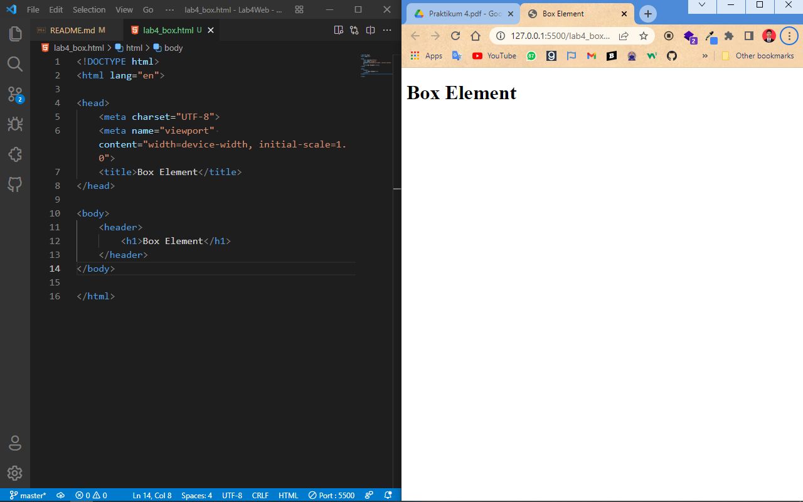

## Langkah 2 `Box Element`
1. Tambahkan kode berikut dibawah header.
```html
<section>
    <div class="div1">Div 1</div>
    <div class="div2">Div 2</div>
    <div class="div3">Div 3</div>
</section>
```

2. Lalu beri css didalam file `lab4_box.html`
```css
div {
    float: left;
    padding: 10px;
}

.div1 {
    background: red;
}

.div2 {
    background: yellow;
}

.div3 {
    background: green;
}
```

3. Maka hasilnya akan seperti berikut.
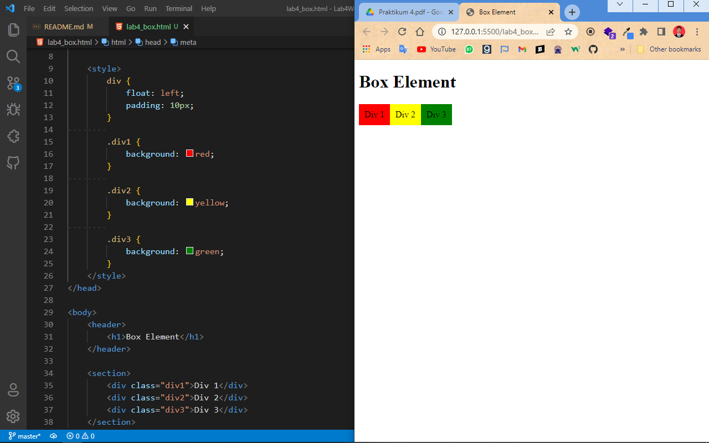

## Langkah 3 `Menambahkan clearfix element`
1. Tambahkan `div` baru dengan _class_ `div4` didalam section/dibawah _class_ `div3`
```html
<div class="div4">Div 4</div>
```
2. Tambahkan style pada element tersebut.
```css
.div4 {
    background-color: blue;
    float: none;
    clear: left;
}
```

3. Maka hasilnya akan seperti berikut.
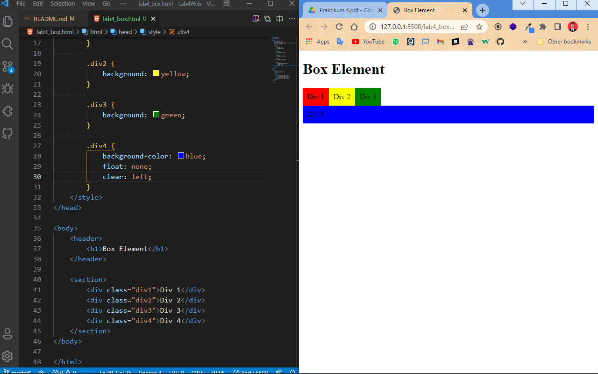

## Langkah 4 `Membuat Layout Sederhana`
1. Buat folder baru dengan nama `lab4_layout`, kemudian buatlah file baru didalamnya dengan nama
`home.html`, dan file css dengan nama `style.css`.

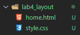

2. Didalam file `home.html`, tambahkan kode html berikut.

```html
<!DOCTYPE html>
<html lang="en">

<head>
    <meta charset="UTF-8">
    <meta http-equiv="X-UA-Compatible" content="IE=edge">
    <meta name="viewport" content="width=device-width, initial-scale=1.0">
    <title>Layout Sederhana</title>

    <!-- CSS -->
    <link rel="stylesheet" href="style.css">
</head>

<body>
    <div id="container">
        <header>
            <h1>Layout Sederhana</h1>
        </header>
        <nav>
            <a href="home.html" class="active">Home</a>
            <a href="artikel.html">Artikel</a>
            <a href="about.html">About</a>
            <a href="kontak.html">Kontak</a>
        </nav>
        <section id="hero"></section>
        <section id="wrapper">
            <section id="main"></section>
            <aside id="sidebar"></aside>
        </section>
        <footer>
            <p>&copy; 2021 - Universitas Pelita Bangsa</p>
        </footer>
    </div>
</body>

</html>
```

3. Maka hasilnya akan seperti berikut.

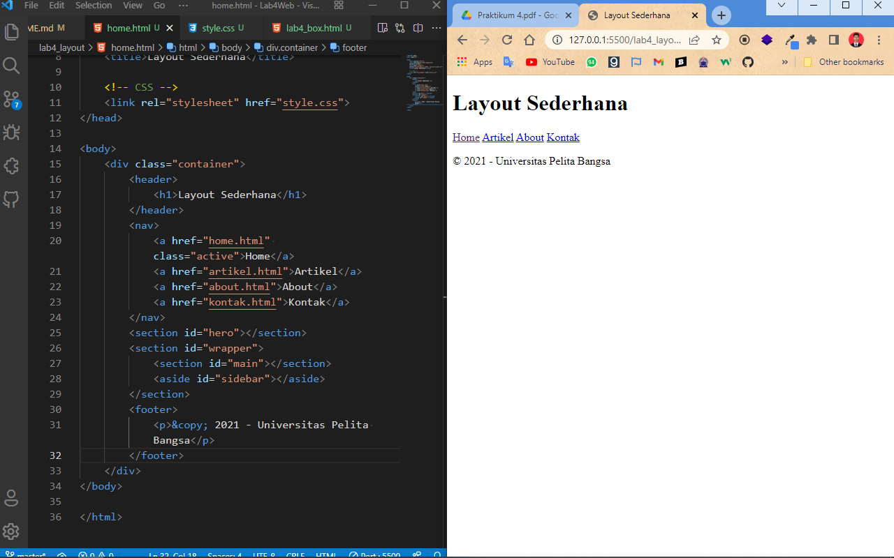

4. Lalu tambahkan css didalam file `style.css`.
```css
/* import google font */
@import url('https://fonts.googleapis.com/css2?family=Open+Sans:ital,wght@0,300;0,400;0,600;0,700;0,800;1,300;1,400;1,600;1,700;1,800&display=swap');

@import url('https://fonts.googleapis.com/css2?family=Open+Sans+Condensed:ital,wght@0,300;0,700;1,300&display=swap');

/* Reset CSS */
* {
    margin: 0;
    padding: 0;
}

body {
    line-height:1;
    font-size:100%;
    font-family:'Open Sans', sans-serif;
    color:#5a5a5a;
}

#container {
    width: 980px;
    margin: 0 auto;
    box-shadow: 0 0 1em #cccccc;
}

/* header */
header {
    padding: 20px;  
}

header h1 {
    margin: 20px 10px;
    color: #b5b5b5;
}
```

4. Maka hasilnya akan seperti berikut.

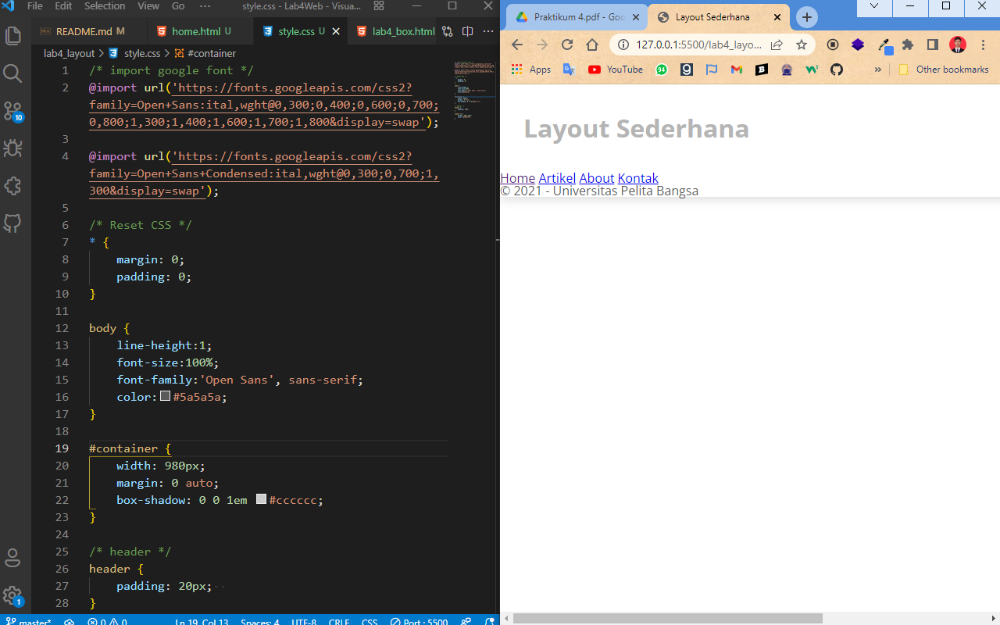

## Langkah 5 `Membuat Navigasi`
1. Tambahkan css berikut didalam file `style.css`.
```css
/* navigasi */
nav {
    display: block;
    background-color: #1f5faa;
}
nav a {
    padding: 15px 30px;
    display: inline-block;
    color: #ffffff;
    font-size: 14px;
    text-decoration: none;
    font-weight: bold;
}
nav a.active,
nav a:hover {
    background-color: #2b83ea;
}
```

2. Maka hasilnya akan seperti berikut.

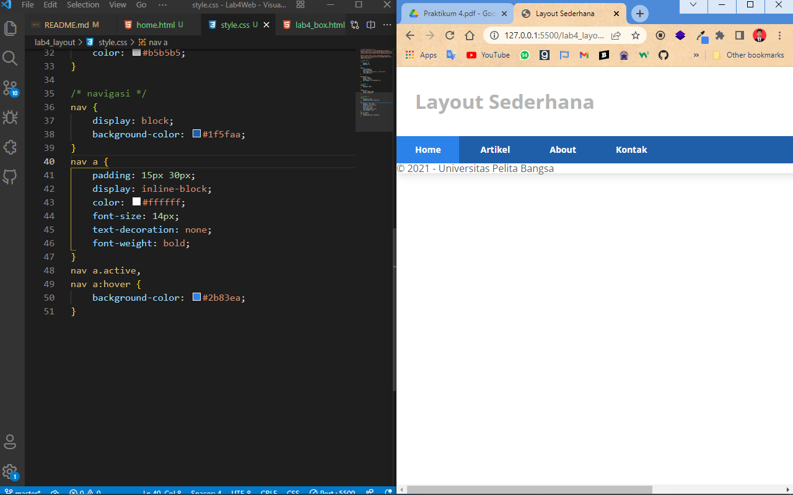

## Langkah 6 `Membuat Hero Panel`
1. Tambahkan kode html berikut didalam file `home.html` di _section_ dengan id `hero`.
```html
<p>Lorem ipsum dolor sit amet, consectetur adipiscing elit. Vestibulum lorem elit, iaculis innisl volutpat, malesuada tincidunt arcu. Proin in leo fringilla, vestibulum mi porta, faucibus felis. Integer pharetra est nunc, nec pretium nunc pretium ac.</p>
<a href="home.html" class="btn btn-large">Learn more &raquo;</a>
```

2. Lalu tambahkan kode css berikut didalam `style.css`.
```css
/* Hero Panel */
#hero {
    background-color: #e4e4e5;
    padding: 50px 20px;
    margin-bottom: 20px;
}
#hero h1 {
    margin-bottom: 20px;
    font-size: 35px;
}
#hero p {
    margin-bottom: 20px;
    font-size: 18px;
    line-height: 25px;
}
```

## Langkah 7 `Mengatur Layout Main dan Sidebar`
1. Tambahkan css berikut.
```css
/* main content */
#wrapper {
    margin: 0;
}

#main {
    float: left;
    width: 640px;
    padding: 20px;
}

/* sidebar area */
#sidebar {
    float: left;
    width: 260px;
    padding: 20px;
}
```

## Langkah 8 `Membuat Sidebar Widget`
1. Tambahkan element berikut didalam id `sidebar`.
```html
<aside id="sidebar">
    <div class="widget-box">
        <h3 class="title">Widget Header</h3>
        <ul>
            <li><a href="#">Widget Link</a></li>
            <li><a href="#">Widget Link</a></li>
            <li><a href="#">Widget Link</a></li>
            <li><a href="#">Widget Link</a></li>
            <li><a href="#">Widget Link</a></li>
        </ul>
    </div>
    <div class="widget-box">
        <h3 class="title">Widget Text</h3>
        <p>Vestibulum lorem elit, iaculis in nisl volutpat, malesuada tincidunt
            arcu. Proin in leo fringilla, vestibulum mi porta, faucibus felis. Integer
            pharetra est nunc, nec pretium nunc pretium ac.</p>
    </div>
</aside>
```

2. Jangan lupa tambahkan css berikut.
```css
/* widget */
.widget-box {
    border:1px solid #eee;
    margin-bottom:20px;
}

.widget-box .title {
    padding:10px 16px;
    background-color:#428bca;
    color:#fff;
}

.widget-box ul {
    list-style-type:none;
}

.widget-box li {
    border-bottom:1px solid #eee;
}

.widget-box li a {
    padding:10px 16px;
    color:#333;
    display:block;
    text-decoration:none;
}

.widget-box li:hover a {
    background-color:#eee;
}

.widget-box p {
    padding:15px;
    line-height:25px;
}
```

3. Maka hasilnya akan seperti berikut.
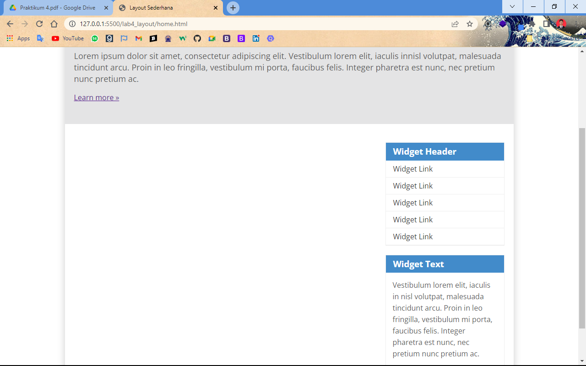

## Langkah 8 `Mengatur Footer`
1. Tambahkan css berikut.
```css 
/* footer */
footer {
    clear:both;
    background-color:#1d1d1d;
    padding:20px;
    color:#eee;
}
```

2. Maka hasilnya seperti berikut.
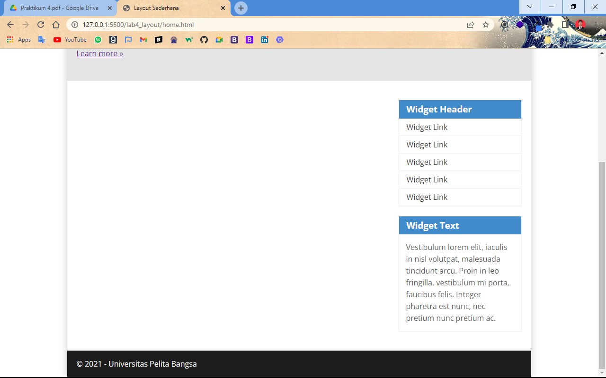

## Langkah 9 `Menambahkan Element lainnya pada Main Content`
1. Tambahkan kode html berikut pada _section_ dengan id `main`.
```html
<section id="main">
    <div class="row">
        <div class="box">
            
            <h3>Heading</h3>
            <p>Donec sed odio dui. Etiam porta sem malesuada magna mollis
                euismod.</p>
            <a href="#" class="btn btn-default">View detail</a>
        </div>
        <div class="box">
            
            <h3>Heading</h3>
            <p>Donec sed odio dui. Etiam porta sem malesuada magna mollis
                euismod.</p>
            <a href="#" class="btn btn-default">View detail</a>
        </div>
        <div class="box">
            
            <h3>Heading</h3>
            <p>Donec sed odio dui. Etiam porta sem malesuada magna mollis
                euismod.</p>
            <a href="#" class="btn btn-default">View detail</a>
        </div>
    </div>
</section>
```

2. Lalu tambahkan kode css berikut.
```css
/* box */
.box {
    display:block;
    float:left;
    width:33.333333%;
    box-sizing:border-box;
    -moz-box-sizing:border-box;
    -webkit-box-sizing:border-box;
    padding:0 10px;
    text-align:center;
}

.box h3 {
    margin: 15px 0;
}

.box p {
    line-height: 20px;
    font-size: 14px;
    margin-bottom: 15px;
}

.box img {
    border: 0;
    vertical-align: middle;
}

.image-circle {
    border-radius: 50%;
}

.row {
    margin: 0 -10px;
    box-sizing: border-box;
    -moz-box-sizing: border-box;
    -webkit-box-sizing: border-box;
}

.row:after, .row:before,
.entry:after, .entry:before {
    content:'';
    display:table;
}

.row:after,
.entry:after {
    clear:both;
}
```

3. Maka hasilnya akan sepert berikut.
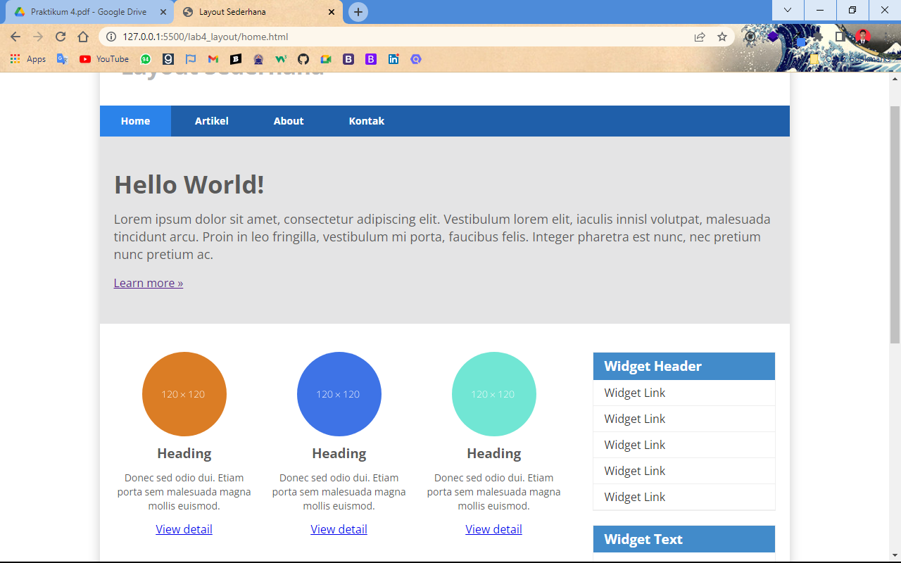

## Langkah 10 `Menambahkan Content Artikel`
1. Tambahkan kode html berikut.
```html
<hr class="divider" />
<article class="entry">
    <h2>First featurette heading.</h2>
    
    <p>Lorem ipsum dolor sit amet, consectetur adipiscing elit. Vestibulum lorem elit, iaculis in nisl volutpat, malesuada tincidunt arcu. Proin in leo fringilla, vestibulum mi porta, faucibus felis. Integer pharetra est nunc, nec pretium nunc pretium ac.</p>
</article>
<hr class="divider" />
<article class="entry">
    <h2>First featurette heading.</h2>
    
    <p>Lorem ipsum dolor sit amet, consectetur adipiscing elit. Vestibulum lorem elit, iaculis in nisl volutpat, malesuada tincidunt arcu. Proin in leo fringilla, vestibulum mi porta, faucibus felis. Integer pharetra est nunc, nec pretium nunc pretium ac.</p>
</article>
```

2. Tambahkan css berikut.
```css
/* Article */
.divider {
    border:0;
    border-top:1px solid #eeeeee;
    margin:40px 0;
}

/* entry */
.entry {
    margin: 15px 0;
}

.entry h2 {
    margin-bottom: 20px;
}

.entry p {
    line-height: 25px;
}

.entry img {
    float: left;
    border-radius: 5px;
    margin-right: 15px;
}

.entry .right-img {
    float: right;
}
```

3. Maka hasilnya seperti berikut.
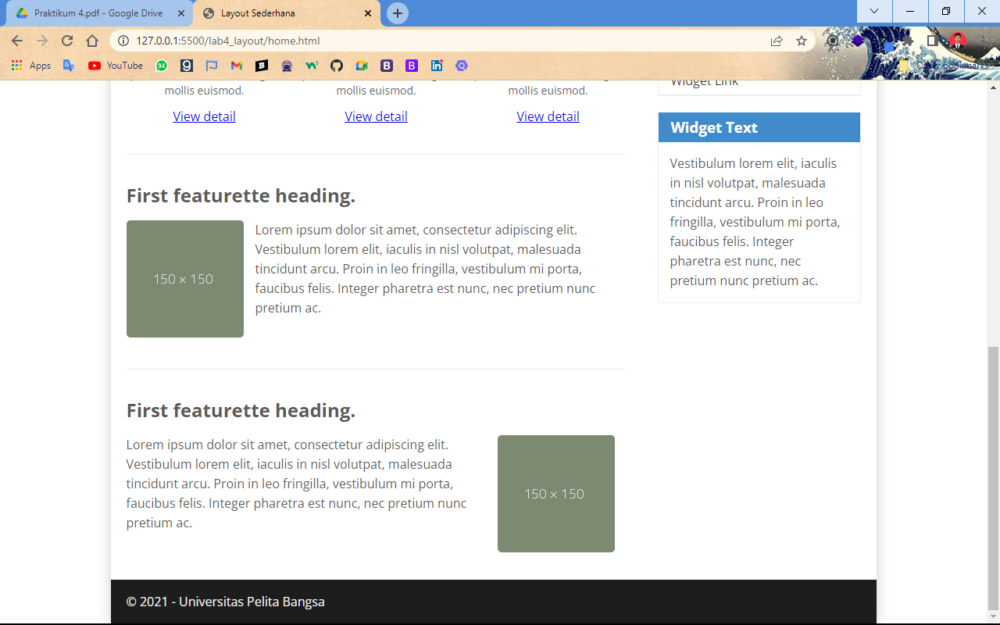

## Pertanyaan dan Tugas
1. Tambahkan Layout untuk menu About
> Buat single layout yang berisi deskripsi, portfolio, dll
2. Tambahkan layout untuk menu Contact
> Berisi form isian: nama, email, message, dll

## Jawab
### 1. Halaman About
#### `HTML`
```html
<!DOCTYPE html>
<html lang="en">

<head>
    <meta charset="UTF-8">
    <meta http-equiv="X-UA-Compatible" content="IE=edge">
    <meta name="viewport" content="width=device-width, initial-scale=1.0">
    <title>About | Reza Riyaldi Irawan</title>

    <!-- CSS -->
    <link rel="stylesheet" href="style.css">
    <link rel="stylesheet" href="style_about.css">

    <!-- Library -->
    <script src="https://kit.fontawesome.com/d00fc238f0.js" crossorigin="anonymous"></script>
</head>

<body>
    <div id="container">
        <header>
            <h1>About Me</h1>
        </header>
        <nav>
            <a href="home.html">Home</a>
            <!-- <a href="artikel.html">Artikel</a> -->
            <a href="about.html"class="active">About</a>
            <a href="kontak.html">Kontak</a>
        </nav>

        <section class="container-about">
            <div class="bio">
                <h1>Profile</h1>
                
                <h4>Reza Riyaldi Irawan</h4>
                <p>Programmer | Designer</p>
                <p class="about">Saya adalah pemuda penuh semangat, terutama dalam hal mencari ilmu baru, dan sangat senang bereksperimen.</p>
            </div>
            <div class="skill">
                <h1>Skill</h1>
                <div class="bungkus">
                    <div class="card designer">
                        <div class="icon icon_desain">
                            <i class="fa-solid fa-paintbrush"></i>
                        </div>
                        <h4>Desain Grafis</h4>
                    </div>
                    <div class="card web_dev">
                        <div class="icon icon_web">
                            <i class="fa-solid fa-globe"></i>
                        </div>
                        <h4>Web Dev</h4>
                    </div>
                    <div class="card android">
                        <div class="icon icon_android">
                            <i class="fa-brands fa-android"></i>
                        </div>
                        <h4>Android Dev</h4>
                    </div>
                    <div class="card video">
                        <div class="icon icon_video">
                            <i class="fa-solid fa-file-video"></i>
                        </div>
                        <h4>Editing Video</h4>
                    </div>
                </div>
            </div>
        </section>
        <footer>
            <p>&copy; 2021 - Universitas Pelita Bangsa</p>
        </footer>
    </div>

</body>

</html>
```

#### CSS
```css
.container-about{
    /* display: flex; */
}

.bio {
    /* width: 30%; */
    display: flex;
    flex-direction: column;
    align-items: center;
    padding: 20px 0;
}

.bio img {
    border-radius: 50%;
    margin: 20px 0;
    border: 6px solid grey;
    width: 130px;
}

.bio h4 {
    margin-bottom: 5px;
}

.bio p.about {
    margin-top: 20px;
}


/* Skill */
.skill {
    /* width: 70%; */
    background-color: aliceblue;
    padding: 30px 20px 50px;
}

.skill h1 {
    text-align: center;
    margin-bottom: 40px;
}

.bungkus {
    display: flex;
}

.card {
    width: 25%;
    display: flex;
    flex-direction: column;
    justify-content: center;
    align-items: center;
    margin: 0 20px;
    box-shadow: 0px 7px 15px 0px rgba(0,0,0,0.2);
    padding: 20px;
    border-radius: 5px;
    background-color: #fff;
}

.icon {
    width: 50px;
    height: 50px;
    display: flex;
    justify-content: center;
    align-items: center;
    border-radius: 50%;
    margin-bottom: 10px;
    /* float: left; */
}

.fa-solid, .fa-brands {
    color: white;
}

.icon_desain {
    background-color: rgb(69, 130, 209);
}

.icon_web {
    background-color: rgb(219, 118, 35);
}

.icon_android {
    background-color: rgb(35, 219, 50);
}

.icon_video {
    background-color: rgb(176, 35, 219);
}
```

#### Hasil
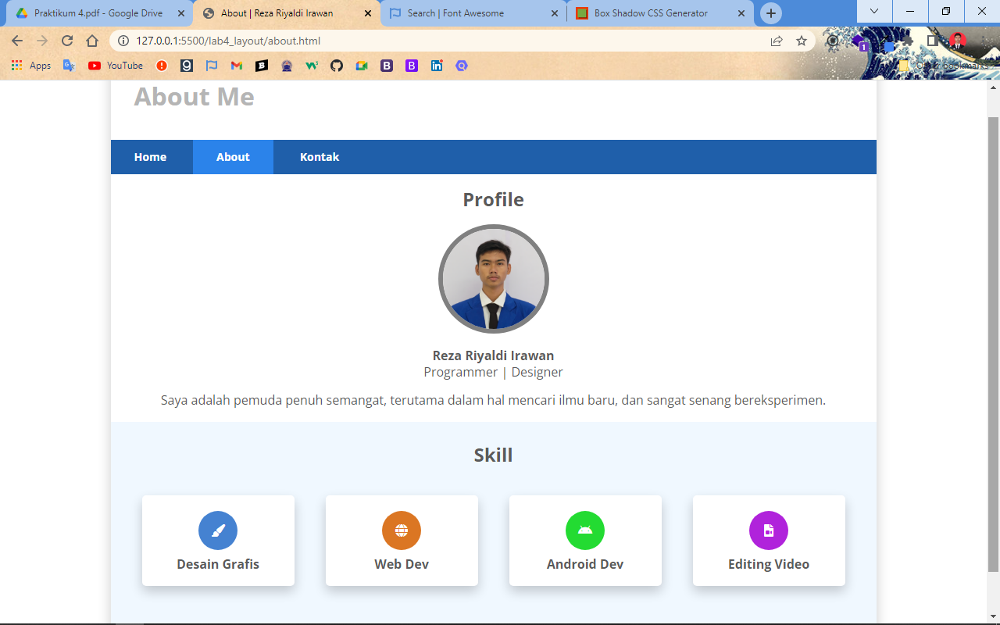